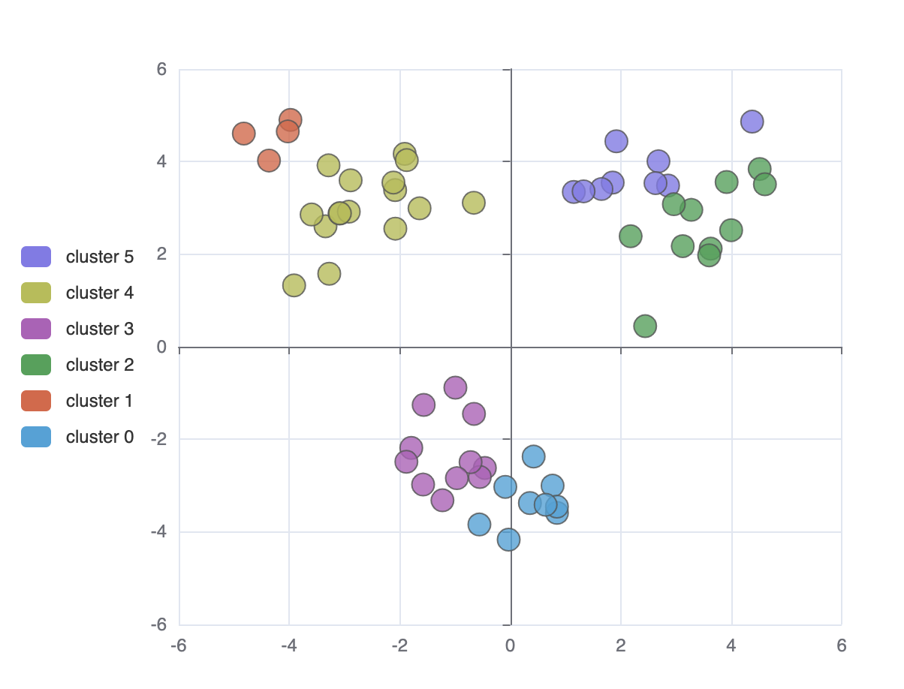
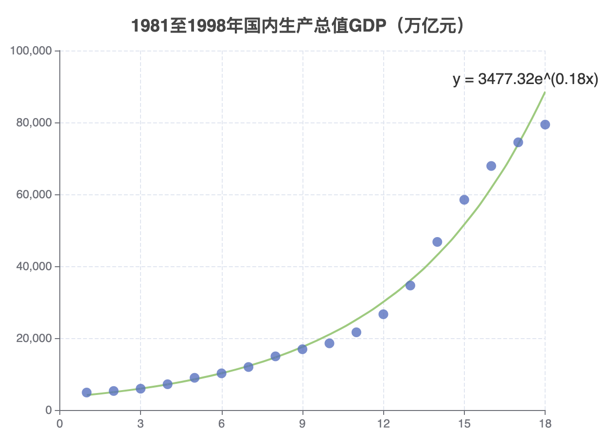
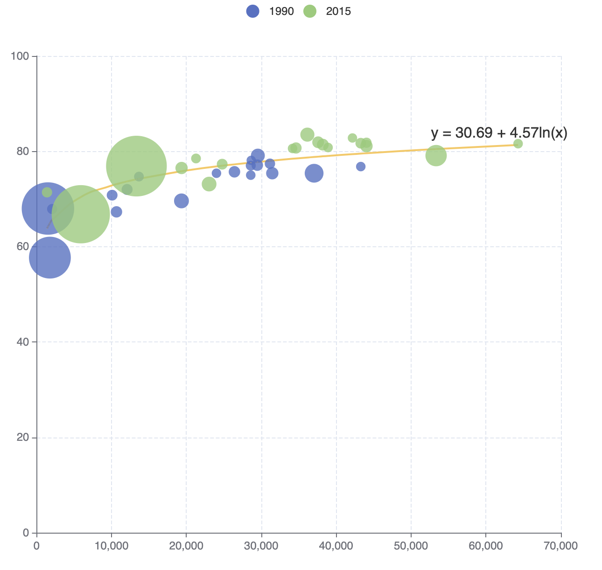

# echarts-stat

A statistical and data mining tools for [ECharts](https://github.com/ecomfe/echarts), you can use it to analyze the data and then visualize the results with ECharts. or just use it to process the data.

## Installing

If you use NPM, you can install it with `npm install ecStat`. Otherwise, download this tool from [dist directory](https://github.com/ecomfe/echarts-stat/tree/master/dist). A `ecStat` global is exported:

```html
<script src='./dist/ecStat.js'></script>
<script>

var result = ecStat.clustering.hierarchicalKMeans(data, clusterNumber, false); 

</script>
```

## API Reference

* [Clustering](#clustering)
* [Regression](#regression)
* [Statistic](#statistic)

### Clustering

Clustering can divide the original data set into multiple data clusters with different characteristics. And through [ECharts](https://github.com/ecomfe/echarts), you can visualize the results of clustering, or visualize the process of clustering.

#### Syntax
```
var result = ecStat.clustering.hierarchicalKMeans(data, clusterNumber, stepByStep);
```
##### Parameter

* data － `Two-dimensional Numeric Array`, each data object can have more than two numeric attributes in the original data set
* clusterNumer － `Number`, the number of clusters generated
* stepByStep － `Boolean`, control whether doing the clustering step by step

##### Return Value

* result － `Object`, including the centroids, clusterAssment, and pointsInCluster.

#### Examples

You can not only do cluster analysis through this interface, you can also use [ECharts](https://github.com/ecomfe/echarts) to visualize the results.

Note: the clustering algorithm can handle multiple numeric attributes, but for the convenience of visualization, two numeric attributes is chosen here as an example.  

##### Directly visualize the results of clustering 

```html
<script src='https://cdn.bootcss.com/echarts/3.4.0/echarts.js'></script>
<script src='./dist/ecStat.js'></script>
<script>

var clusterNumber = 3;
var result = ecStat.clustering.hierarchicalKMeans(data, clusterNumber, false); 

</script>
```



[Run](http://gallery.echartsjs.com/editor.html?c=xSkBOEaGtx)

##### Visualize the process of clustering

```html
<script src='https://cdn.bootcss.com/echarts/3.4.0/echarts.js'></script>
<script src='./dist/ecStat.js'></script>
<script>
	
var clusterNumber = 6;
var result = ecStat.clustering.hierarchicalKMeans(data, clusterNumber, true); 

</script>
```


[Run](http://gallery.echartsjs.com/editor.html?c=xHyr-esMtg)


### Regression

Regression algorithm can according to the value of the dependent and independent variables of the data set, fitting out a curve to reflect their trends. The regression algorithm here only supports two numeric attributes. 

#### Syntax
```
var myRegression = ecStat.regression(regressionType, data, order);
```
##### Parameters

* regressionType - `String`, there are four types of regression, whice are `linear`, `exponential`, `logarithmic`, `polynomial`
* data - `Two-dimensional Numeric Array`, each data object should have two numeric attributes in the original data set
* order - `Number`, the order of polynomial. If you choose other types of regression, you can ignore this

##### Return Value

* myRegression - `Object`, Including points, parameter, and expression

#### Examples

You can not only do regression analysis through this interface, you can also use [ECharts](https://github.com/ecomfe/echarts) to visualize the results.

##### Linear Regression 

```html
<script src='https://cdn.bootcss.com/echarts/3.4.0/echarts.js'></script>
<script src='./dist/ecStat.js'></script>
<script>

var myRegression = ecStat.regression('linear', data);

</script>
```


[Run](http://gallery.echartsjs.com/editor.html?c=xS1bQ2AMKe)

##### Exponential Regression

```html
<script src='https://cdn.bootcss.com/echarts/3.4.0/echarts.js'></script>
<script src='./dist/ecStat.js'></script>
<script>
	
var myRegression = ecStat.regression('exponential', data);

</script>
```



[Run](http://gallery.echartsjs.com/editor.html?c=xHyaNv0fFe&v=5)

##### Logarithmic Regression

```html
<script src='https://cdn.bootcss.com/echarts/3.4.0/echarts.js'></script>
<script src='./dist/ecStat.js'></script>
<script>
	
var myRegression = ecStat.regression('logarithmic', data);

</script>
```



[Run](http://gallery.echartsjs.com/editor.html?c=xry3aWkmYe)

##### Polynomial Regression

```html
<script src='https://cdn.bootcss.com/echarts/3.4.0/echarts.js'></script>
<script src='./dist/ecStat.js'></script>
<script>
	
var myRegression = ecStat.regression('polynomial', data, 3);

</script>
```


[Run](http://gallery.echartsjs.com/editor.html?c=xB16yW0MFl)


### Statistic

This interface provides general statistical services such as maximum, minimum, average, median, sum, etc.

#### ecStat.statistic.max()

##### Syntax
```
var maxValue = ecStat.statistic.max(dataList);
```
##### Parameter

* dataList : `Array.<number>`
 
##### Return Value

* maxValue: `Number`, the maximum value of the data list


#### ecStat.statistic.min()

##### Syntax
```
var minValue = ecStat.statistic.min(dataList);
```
##### Parameter

* dataList : `Array.<number>`
 
##### Return Value

* minValue: `Number`, the minimum value of the data list


#### ecStat.statistic.mean()

##### Syntax
```
var meanValue = ecStat.statistic.mean(dataList);
```
##### Parameter

* dataList : `Array.<number>`
 
##### Return Value

* meanValue: `Number`, the average of the data list


#### ecStat.statistic.median()

##### Syntax
```
var medianValue = ecStat.statistic.median(dataList);
```
##### Parameter

* dataList : `Array.<number>`
 
##### Return Value

* medianValue: `Number`, the median of the data list


#### ecStat.statistic.sum()

##### Syntax
```
var sumValue = ecStat.statistic.sum(dataList);
```
##### Parameter

* dataList : `Array.<number>`
 
##### Return Value

* sumValue: `Number`, the sum of the data list


