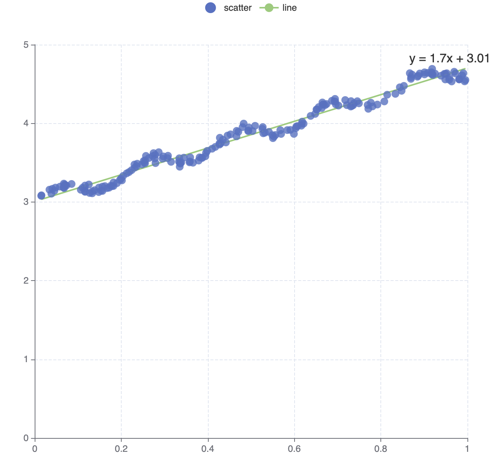
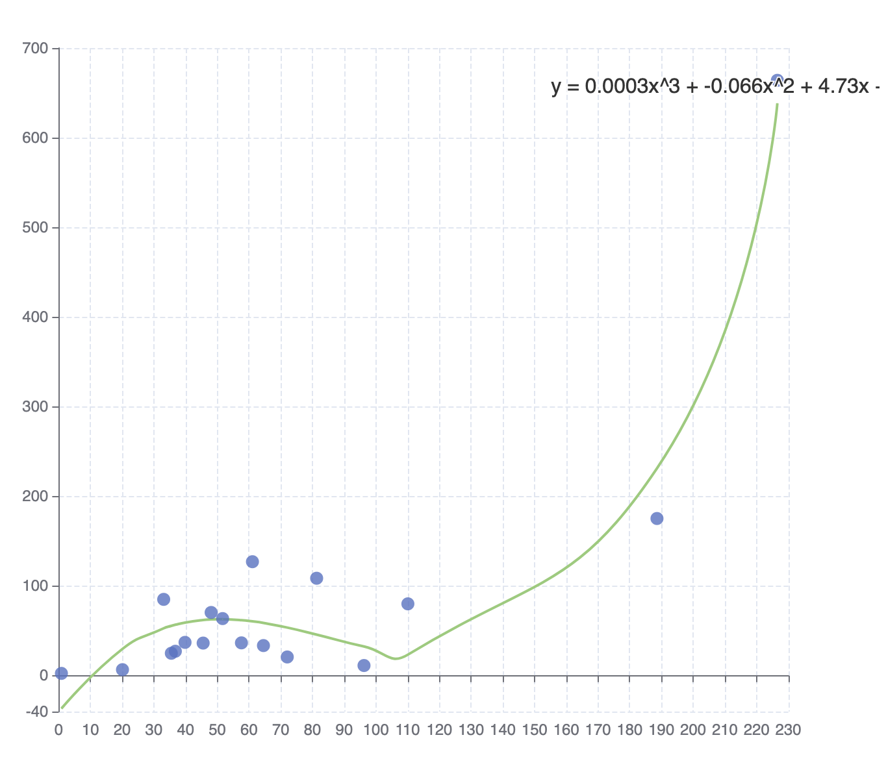

# ecStat

ecStat 是 [Apache ECharts (incubating)](https://github.com/apache/incubator-echarts) 的统计和数据挖掘工具。你可以把它当作一个工具库直接用来分析数据；你也可以将其与 ECharts 结合使用，用 ECharts 可视化数据分析的结果。

同时支持 Node 和浏览器中使用。

*其他语言版本: [English](README.md), [简体中文](README.zh-CN.md).*

## 安装

如果你使用 npm ，直接运行下面的命令:

```sh
 npm install echarts-stat
```

或者， 从 [dist](https://github.com/ecomfe/echarts-stat/tree/master/dist) 目录直接下载引用:

```html
<script src='./dist/ecStat.js'></script>
<script>

var result = ecStat.clustering.hierarchicalKMeans(data, clusterNumber, false);

</script>
```

## API

* [直方图](#histogram)
* [聚类](#clustering)
* [回归](#regression)
* [基本统计方法](#statistic)

### 直方图

直方图主要用来可视化数值型数据的分布情况。用以直观判断数值型数据的概率分布，是一种特殊类型的柱状图。构建直方图的第一步是将总的数值区间切割成一个个小的区间间隔，然后统计落入每个区间间隔中的数值样本个数，并且每个小区间间隔都是连续的、大小相等的、相互不重叠的，即 [[x0, x1), [x1, x2), [x2, x3]]。

#### 调用方式

```js
var bins = ecStat.histogram(data, binMethod);
```

##### 参数说明

* `data` - `Array<number>`. 数值样本.

    ```js
    var data = [8.6, 8.8, 10.5, 10.7, 10.8, 11.0, ... ];
    ```

* `binMethod` - `string`. 直方图提供了四种计算小区间间隔个数的方法，分别是 `squareRoot`, `scott`, `freedmanDiaconis` 和 `sturges`。这里的每个小区间间隔又称为 `bin`，所有的小区间间隔组成的数组称为 `bins`。当然，对于一个直方图来说，没有所谓的最佳区间间隔个数，不同的区间间隔大小会揭示数据样本不同的数值特性。

    * `squareRoot` - 默认方法，Excel 的直方图中也是使用这个方法计算 `bins`。依照 [Square-root choice](https://en.wikipedia.org/wiki/Histogram#Mathematical_definition) 返回 bin 的个数:
        ```js
        var bins = ecStat.histogram(data);
        ```

    * `scott` - 依照 [Scott's normal reference Rule](https://en.wikipedia.org/wiki/Histogram#Mathematical_definition) 返回 bin 的个数:
        ```js
        var bins = ecStat.histogram(data, 'scott');
        ```

    * `freedmanDiaconis` - 依照 [The Freedman-Diaconis rule](https://en.wikipedia.org/wiki/Histogram#Mathematical_definition) 返回 bin 的个数:
        ```js
        var bins = ecStat.histogram(data, 'freedmanDiaconis');
        ```

    * `sturges` - 依照 [Sturges' formula](https://en.wikipedia.org/wiki/Histogram#Mathematical_definition) 返回 bin 的个数:
        ```js
        var bins = ecStat.histogram(data, 'sturges');
        ```

##### 返回值说明

* `bins` - `Object`. 返回值包含了每一个 bin 的详细信息，以及用 [ECharts](https://github.com/ecomfe/echarts) 绘制直方图所需要的数据信息。
    * `bins.bins` - `Array.<Object>`. 包含所有小区间间隔的数组，其中每个区间间隔是一个对象，包含如下三个属性：
        * `x0` - `number`. 区间间隔的下界 (包含)。
        * `x1` - `number`. 区间间隔的上界 (不包含)。
        * `sample` - `Array.<number>`. 落入该区间间隔的原始输入样本数据。
    * `bins.data` - `Array.<Array.<number>>`. 用 ECharts 柱状图绘制直方图所需要的数据信息。这是一个二维数据，其中每个数据项是一个一维数组。该一维数组包含了 x0 和 x1 的均值，以及上述 sample 数组的长度，示例如下：
        ```js
        var bins.data = [
            [mean1, len1],
            [mean2, len2],
                ...
        ];
        ```
    * `bins.customData` - `Array.<Array<number>>`. 用 ECharts 自定义图表绘制直方图所需要的数据信息。这是一个二维数据，其中每个数据项是一个一维数组。该一维数组包含了 x0 和 x1，以及上述 sample 数组的长度，示例如下：
        ```js
        var bins.customData = [
            [x0, x1, len1],
                ...
        ];
        ```

#### 实例

这个示例使用 ECharts 自定义图表绘制直方图，相较于柱状图我们更推荐使用自定义图表绘制直方图。

```html
<script src='https://cdn.bootcss.com/echarts/3.4.0/echarts.js'></script>
<script src='./dist/ecStat.js'></script>
<script>

var bins = ecStat.histogram(data);
var option = {
    ...
    series: [{
        type: 'custom',
        ...
    }],
    ...
}

</script>
```


[Run](http://gallery.echartsjs.com/editor.html?c=xBk5VZddJW)


### 聚类

聚类可以将原始输入数据分割成多个具有不同特征的数据簇。并且通过 [ECharts](https://github.com/ecomfe/echarts) 既可以可视化聚类的结果，也可以可视化聚类的分割过程。

#### 调用方式
```js
var result = ecStat.clustering.hierarchicalKMeans(data, clusterNumber, stepByStep);
```
##### 参数说明

* `data` － `Array.<Array.<number>>`. 这是一个二维数组，其中每个数据对象是具有多个数值属性的一维数组。如下，`data[0]` 就是一个数据对象，`data[0][1]` 是该数据对象的一个数值属性。

    ```js
    var data = [
        [1, 2, 3, 4, 5],
        [6, 7, 8, 9, 10],
        [11, 12, 13, 14, 15],
        ...
        ];
    ```
* `clusterNumer` － `number`. 要生成的数据簇的个数。 **注意，该数值必须大于 1。**
* `stepByStep` － `boolean`. 该参数主要用于可视化聚类算法每一步的分割过程，即动态地展示数据簇如何从 2 个到 3 个，4 个， .... 。

##### 返回值说明

* `result` － `Object`. 包含每个数据簇的中心点 centroids，聚类的评估结果 clusterAssment，以及每个数据簇所包含的原始数据对象 pointsInCluster。如下:

    ```js
    result.centroids = [

        [-0.460, -2.778],
        [2.934, 3.128],
        ...
    ];

    // indicate which cluster each data point belonging to,
    // and the distance to cluster centroids
    result.clusterAssment = [

        [1, 0.145],
        [2, 0.680],
        [0, 1.022],
        ...
    ];

    // concrete data point in each cluster
    result.pointsInCluster = [
        [
            [0.335, -3.376],
            [-0.994, -0.884],
            ...
        ],
        ...
    ];
    ```

#### 实例

调用该接口不仅可以做聚类分析，还可以将聚类的结果用 [ECharts](https://github.com/ecomfe/echarts) 展现出来。

**注意：聚类算法可以处理具有多个数值属性的一组数据对象，这里为了可视化的方便，我们以具有两个数值属性的数据对象为例。**

##### 直接可视化聚类算法的最终结果

```html
<script src='https://cdn.bootcss.com/echarts/3.4.0/echarts.js'></script>
<script src='./dist/ecStat.js'></script>
<script>

var clusterNumber = 3;
var result = ecStat.clustering.hierarchicalKMeans(data, clusterNumber, false);

</script>
```


[Run](http://gallery.echartsjs.com/editor.html?c=xSkBOEaGtx)

##### 可视化聚类的过程

```html
<script src='https://cdn.bootcss.com/echarts/3.4.0/echarts.js'></script>
<script src='./dist/ecStat.js'></script>
<script>

var clusterNumber = 6;
var result = ecStat.clustering.hierarchicalKMeans(data, clusterNumber, true);

</script>
```


[Run](http://gallery.echartsjs.com/editor.html?c=xHyr-esMtg)


### 回归

回归算法根据原始输入数据集中自变量和因变量的值拟合出一条曲线，以反映它们的变化趋势。目前只支持单个自变量的回归算法。

#### 调用方式
```js
var myRegression = ecStat.regression(regressionType, data, order);
```
##### 参数说明

* `regressionType` - `string`. 回归类型，提供了四种类型的回归算法，分别是 `'linear'`, `'exponential'`, `'logarithmic'`, `'polynomial'`。
* `data` - `Array.<Array.<number>>`. 原始的输入数据是一个二维的数值数组，其中每个数据对象是包含两个数值属性的一维数组，分别表示自变量和因变量的值。如下：
    ```js
    var data = [
        [1, 2],
        [3, 5],
        ...
    ];
    ```
* `order` - `number`. 多项式的阶数。对于非多项式回归，可以忽略该参数。

##### 返回值说明

* `myRegression` - `Object`. 包括用于绘制折线图的拟合数据点 `points`，回归曲线的参数 `parameter`，以及拟合出的曲线表达式 `expression`。如下：

    ```js
    myRegression.points = [
        [1, 2],
        [3, 4],
        ...
    ];

    // this is the parameter of linear regression,
    // for other types, it shoule be a little different
    myRegression.parameter = {
        gradient: 1.695,
        intercept: 3.008
    };

    myRegression.expression = 'y = 1.7x + 3.01';
    ```

#### 实例

不仅可以调用该接口做回归分析，还可以将分析的结果用 [ECharts](https://github.com/ecomfe/echarts) 展现出来。

##### 线性回归

```html
<script src='https://cdn.bootcss.com/echarts/3.4.0/echarts.js'></script>
<script src='./dist/ecStat.js'></script>
<script>

var myRegression = ecStat.regression('linear', data);

</script>
```



[Run](http://gallery.echartsjs.com/editor.html?c=xS1bQ2AMKe)

##### 指数回归

```html
<script src='https://cdn.bootcss.com/echarts/3.4.0/echarts.js'></script>
<script src='./dist/ecStat.js'></script>
<script>

var myRegression = ecStat.regression('exponential', data);

</script>
```


[Run](http://gallery.echartsjs.com/editor.html?c=xHyaNv0fFe&v=5)

##### 对数回归

```html
<script src='https://cdn.bootcss.com/echarts/3.4.0/echarts.js'></script>
<script src='./dist/ecStat.js'></script>
<script>

var myRegression = ecStat.regression('logarithmic', data);

</script>
```


[Run](http://gallery.echartsjs.com/editor.html?c=xry3aWkmYe)

##### 多项式回归

```html
<script src='https://cdn.bootcss.com/echarts/3.4.0/echarts.js'></script>
<script src='./dist/ecStat.js'></script>
<script>

var myRegression = ecStat.regression('polynomial', data, 3);

</script>
```



[Run](http://gallery.echartsjs.com/editor.html?c=xB16yW0MFl)


### 基本统计方法

这些接口提供了基本汇总统计功能。

#### ecStat.statistics.deviation()

##### 调用方式
```js
var sampleDeviation = ecStat.statistics.deviation(dataList);
```
##### 参数说明

* `dataList` : `Array.<number>`. 输入的数值样本集。

##### 返回值说明

* `sampleDeviation`: `number`. 返回输入数组 *dataList* 的标准差。如果 *dataList* 为空或者长度小于 2，返回 0.


#### ecStat.statistics.sampleVariance()

##### 调用方式
```js
var varianceValue = ecStat.statistics.sampleVariance(dataList);
```
##### 参数说明

* `dataList` : `Array.<number>`. 输入的数值样本集。

##### 返回值说明

* `varianceValue`: `number`. 返回输入数组 *dataList* 的样本方差。如果 *dataList* 为空或者长度小于 2，返回 0.


#### ecStat.statistics.quantile()

##### 调用方式
```js
var quantileValue = ecStat.statistics.quantile(dataList, p);
```
##### 参数说明

* `dataList` : `Array.<number>`. 输入的数值数组，该数组必须是按从小到大有序排列的.
* `p`: `number`. 分位数，取值在 [0, 1] 之间. 例如, 第一四分位数对应的 p 值是 0.25；第二四分位数，也就是中位数，对应的 p 值是 0.5；第三四分位数对应的 p 值是 0.75.

##### 返回值说明

* `quantileValue`: `number`. 计算得到的分位数值。如果输入的 *p* 值小于等于 0 或者 *dataList* 的长度小于2，则返回有序数组 *dataList* 的第一个值；如果输入的 *p* 值大于等于1，则返回有序数组 *dataList* 的最后一个值；如果输入的有序数组 *dataList* 为空，则返回 0.


#### ecStat.statistics.max()

##### 调用方式
```js
var maxValue = ecStat.statistics.max(dataList);
```
##### 参数说明

* `dataList` : `Array.<number>`. 输入的数值样本集。

##### 返回值说明

* `maxValue`: `number`. 返回输入数组 *dataList* 的最大值。


#### ecStat.statistics.min()

##### 调用方式
```js
var minValue = ecStat.statistics.min(dataList);
```
##### 参数说明

* `dataList` : `Array.<number>`. 输入的数值样本集。

##### 返回值说明

* `minValue`: `number`. 返回输入数组 *dataList* 的最小值。


#### ecStat.statistics.mean()

##### 调用方式
```js
var meanValue = ecStat.statistics.mean(dataList);
```
##### 参数说明

* `dataList` : `Array.<number>`. 输入的数值样本集。

##### 返回值说明

* `meanValue`: `number`. 返回输入数组 *dataList* 的平均值。


#### ecStat.statistics.median()

##### 调用方式
```js
var medianValue = ecStat.statistics.median(dataList);
```
##### 参数说明

* `dataList` : `Array.<number>`. 输入的数值数组，该数组必须是按从小到大有序排列的.

##### 返回值说明

* `medianValue`: `number`. 返回输入数组 *dataList* 的中位数。


#### ecStat.statistics.sum()

##### 调用方式
```js
var sumValue = ecStat.statistics.sum(dataList);
```
##### 参数说明

* `dataList` : `Array.<number>`. 输入的数值样本集。

##### 返回值说明

* `sumValue`: `number`. 返回输入数组 *dataList* 的求和结果。


